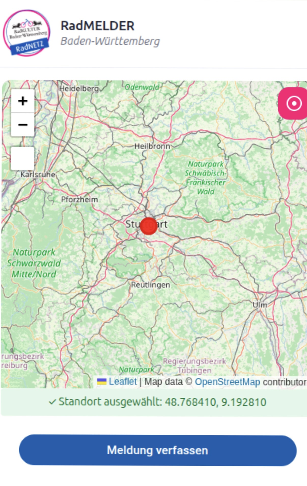
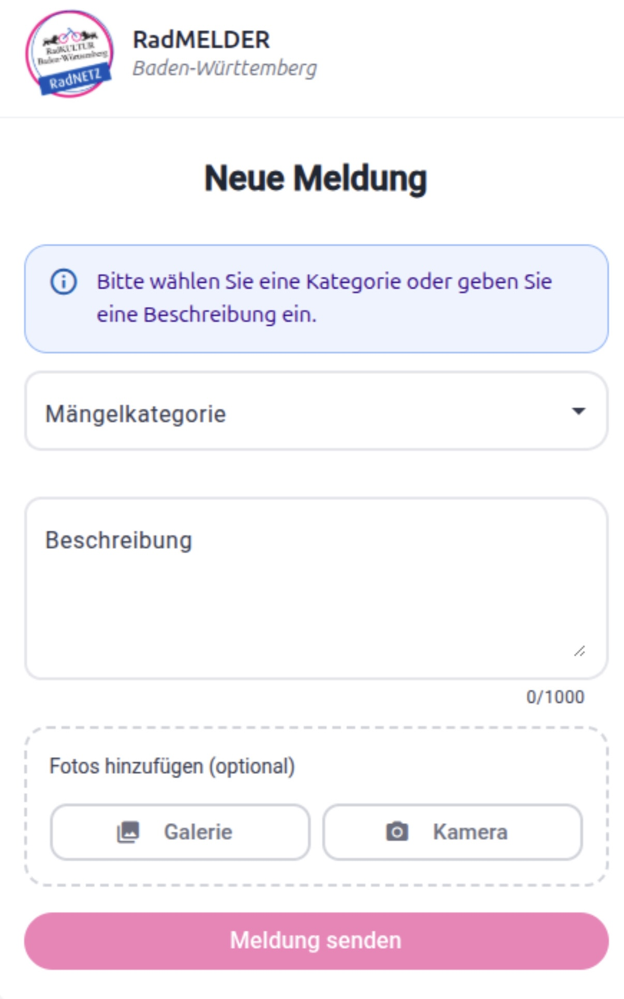
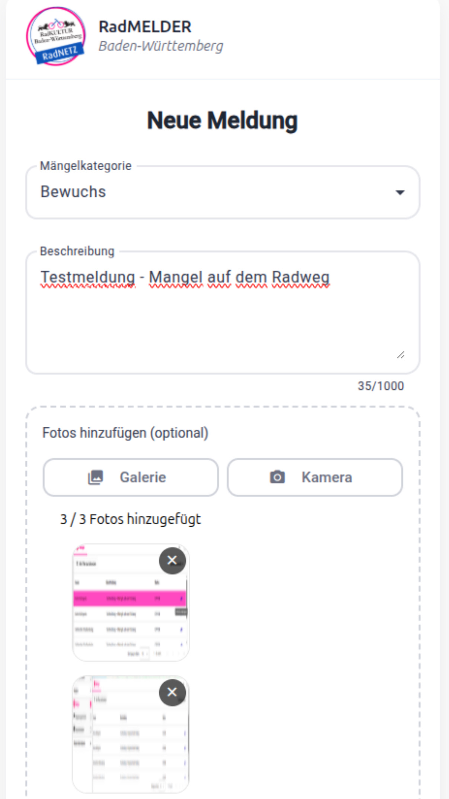
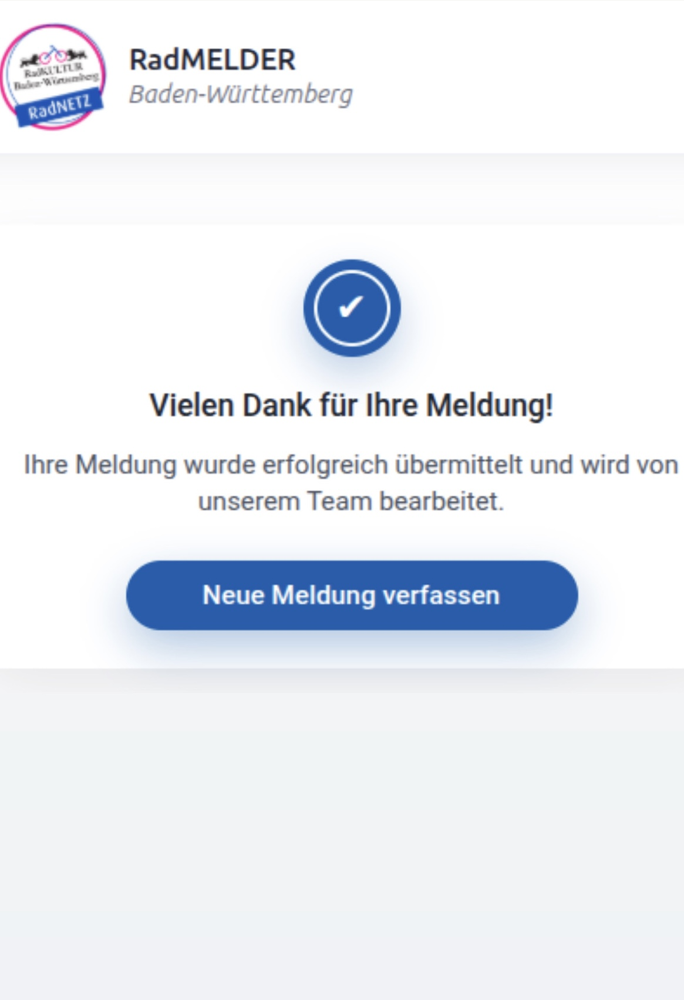

# 🚲 RadVIS – Mängelmeldung per Karten-Klick

Die **Mängelmelder-App** ermöglicht es Nutzer:innen, Infrastrukturmängel im Radverkehr über eine interaktive Karte zu erfassen. Sie ist Teil des übergeordneten **RadVIS-Projekts** – dieses Repository enthält ausschließlich die Mängelmelder-App (Frontend + Mock-Backend).

> **Hinweis:** Das produktive RadVIS-Backend zur Verwaltung, Analyse und Visualisierung der Meldungen befindet sich in einem separaten Repository.

---

## Features

- 📍 Standortauswahl per Karten-Klick mit automatischer Koordinatenübernahme
- 📌 Marker-Platzierung auf der Karte
- 📝 Formular zur Mängelbeschreibung mit Kategorieauswahl
- 📷 Foto-Upload (max. 3 Bilder)

---

## Screenshots

### Standortauswahl auf der Karte

Der Standort des Mangels wird interaktiv über eine Karte ausgewählt. Die Koordinaten werden automatisch übernommen.



### Neue Mängelmeldung

Nutzer:innen können eine neue Meldung erfassen, indem sie eine Kategorie auswählen, eine Beschreibung eingeben und optional Fotos hochladen.




### Erfolgreiche Meldung

Nach dem Absenden erhält der/die Nutzer:in eine Bestätigung über die erfolgreiche Übermittlung.



---

## Tech-Stack

| Bereich | Technologien |
|---|---|
| **Frontend** | Angular, Angular Material, Leaflet (Karten) |
| **Backend (Mock-Service)** | Java, Spring Boot, REST-API |

> Das Backend dient ausschließlich als **Mock-Service** für Entwicklung und Demo und ersetzt nicht das produktive RadVIS-Backend.

---

## Installation

### Voraussetzungen

- [Node.js](https://nodejs.org/) (LTS empfohlen)
- [Java 17+](https://adoptium.net/) (für das Mock-Backend)
- [Maven](https://maven.apache.org/) oder der enthaltene Maven-Wrapper

### Projekt klonen

```bash
git clone https://github.com/WPS-radvis/radvis_maengelmelder.git
cd radvis_maengelmelder
```

### Frontend starten

```bash
cd frontend
npm install
npm run start:frontend
```

Das Frontend läuft anschließend unter: **http://localhost:4200**

### Backend starten

```bash
cd backend
./mvnw spring-boot:run
```

---

## Dokumentation

### 🎨 Frontend (Compodoc)

Die Frontend-Dokumentation wird mit [Compodoc](https://compodoc.app/) generiert. Das Tool scannt den Code und erstellt eine übersichtliche Darstellung aller Komponenten und Module.

```bash
cd frontend

# Doku generieren
npm run docs:frontend

# Doku im Browser öffnen (http://localhost:8080)
npx compodoc -s -d doc/frontend
```

> **Info:** Der Quellcode wird in der Doku ausgeblendet (`--disableSourceCode`), sodass nur die Beschreibungen sichtbar sind.

### ⚙️ Backend (Swagger / OpenAPI)

Die API-Dokumentation ist vollständig mit OpenAPI / Swagger dokumentiert. Alle Endpunkte können interaktiv ausprobiert werden:

🔗 [Swagger UI auf SwaggerHub](https://app.swaggerhub.com/apis/YADIGARCC/radvis_maengelmelder/1.0.0)

> **Wichtig:** Das Backend muss gestartet sein, damit die Endpunkte erreichbar sind.
