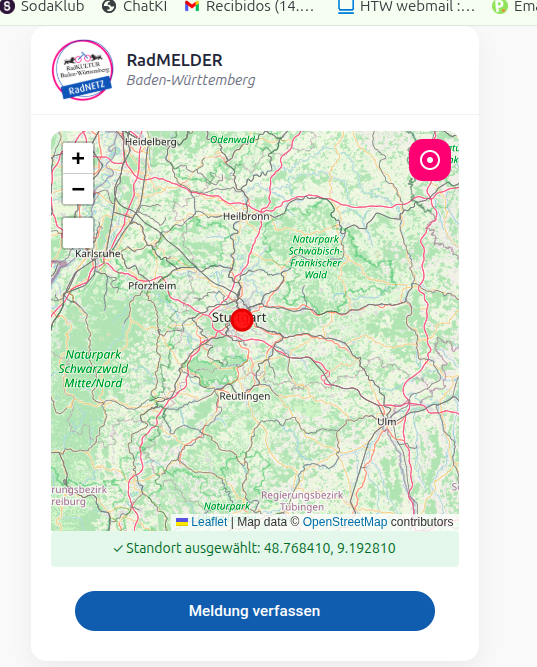
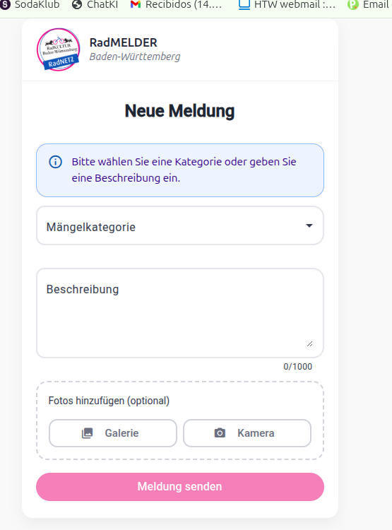
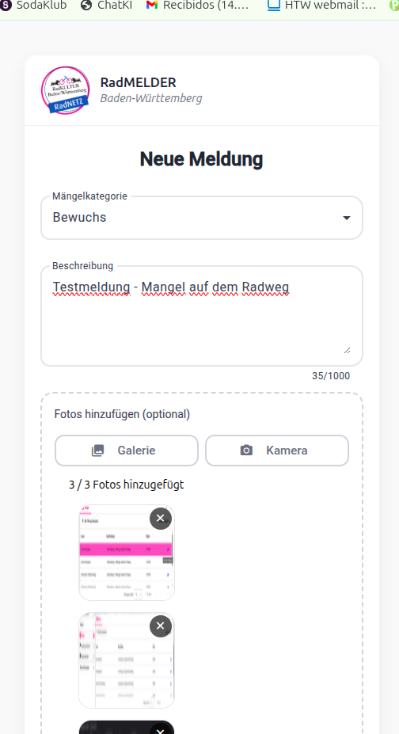
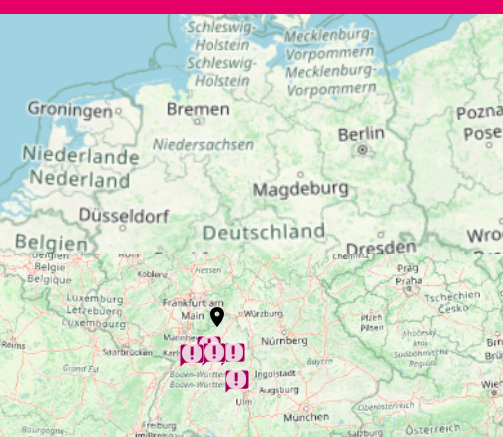
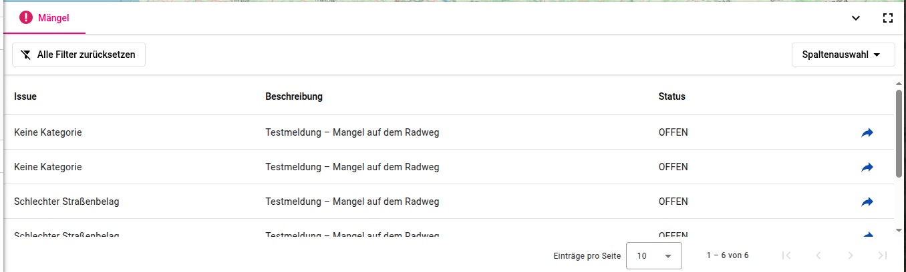
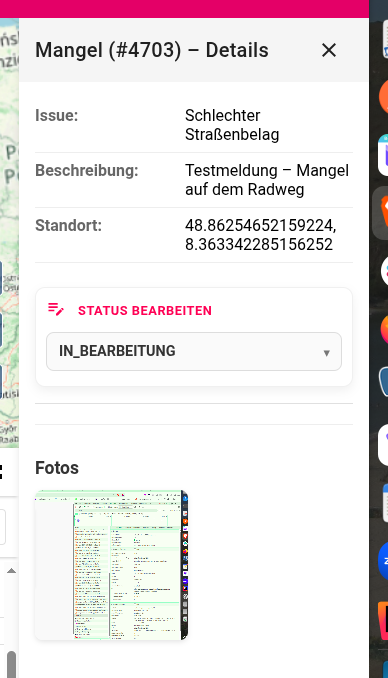
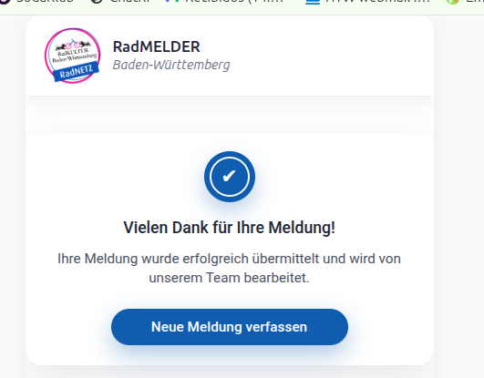

# 🚲 RadVIS - Mängelmeldung per Karten-Klick 
RadVis ist eine Webanwenung zur Meldung von Infrastrukturmängeln.
Nutzer können einen Standort über eine interaktive Karte auswählen,
ein Formular ausfüllen und optional Fotos hochladen.

## Features
- 📍 Standortauswahl per Karten-Klick
- 📌 Marker wird auf der Karte gesetzt
- 📝 Formular zur Mängelbeschreibung
- 📷 Foto-Upload (max. 3 Bilder)

## Standortauswahl auf der Karte
Der Standort des Mängels wird interaktiv über eine Karte ausgewählt.
Die Koordinaten werden automatisch übernommen.


## Neue Mängelmeldung
Nutzer können eine neue Meldung erfassen, indem sie:
- eine Mängelkategorie auswählen
- eine Beschreibung eingeben
- optional Fotos hochladen



## Übersicht aller gemeldeten Mängel
Alle gemeldeten Mängel werden auf einer interaktiven Karte angezeigt.
Jeder Marker repräsentiert eine Meldung.


## Mängelliste
Zusätzlich zur Kartenansicht gibt es eine tabllarische Übersicht.
Die Einträge sind filterbar und zeigen den aktuellen Status.


## Detailansicht eines Mangels
In der Detailansicht sind alle Informationen zu einer Meldung sichtbar:
- Kategorie
- Beschreibung
- Standort
- Status
- hochgeladene Fotos
  Der Status kann hier bearbeitet werden.
  

  ## Erfolgreicheen Meldung
  Nach dem Absenden einer Meldung erhält der Nutzer eine Bestätigung, dass die Meldung erfolgreich übermittelt wurde.
  


## Tech-Stack
-Angular
-Angular Material
Java Backend (REST)

## Installation
- ```bash
  - npm install
  - npm start
  - Frontend läuft unter: https://localhost4200
  
# 🚲 RadVis Mängelmelder – Projektdokumentation

Dieses Repository enthält das System zur Erfassung und Visualisierung von Radverkehrs-Mängeln. Um die Wartbarkeit des Codes zu gewährleisten, setzen wir auf automatisierte Dokumentations-Tools für das Frontend und das Backend.

---

# 🚲 RadVis Mängelmelder – Doku-Guide

Damit wir beim Coden nicht den Überblick verlieren und neue Leute sich schnell zurechtfinden, schreiben wir unsere Doku nicht von Hand, sondern lassen sie uns generieren. Hier steht, wie du das machst.

---

## 🛠 So kriegst du die Doku

### 🎨 Frontend (Angular)
Wir nutzen **Compodoc**. Das Tool scannt unseren Code und baut daraus eine schicke Website, auf der man sieht, wie Komponenten und Module zusammenhängen.

1. Geh in den `frontend` Ordner.
2. **Doku bauen:** `npm run docs:frontend`
3. **Doku anschauen:** `npx compodoc -s -d doc/frontend` (läuft dann auf [http://localhost:8080](http://localhost:8080))

> **Info:** Wir verstecken den echten Quellcode in der Doku (`--disableSourceCode`), damit es übersichtlich bleibt und man nur die Beschreibungen sieht.

---

### ⚙️ Backend (Mock-API)
Das Backend ist als Spring Boot Mock-Service implementiert. Es stellt die notwendigen Endpunkte für die Radverkehrs-Visualisierung bereit und validiert die Datenstrukturen.

📖 API-Dokumentation
Die Schnittstellen sind vollständig mit OpenAPI / Swagger dokumentiert. Hier können alle Endpunkte interaktiv ausprobiert werden.

Swagger UI: https://app.swaggerhub.com/apis/YADIGARCC/radvis_maengelmelder/1.0.0

[!IMPORTANT] Voraussetzung: Das Backend muss gestartet sein.

Bash
cd backend
./mvnw spring-boot:run


